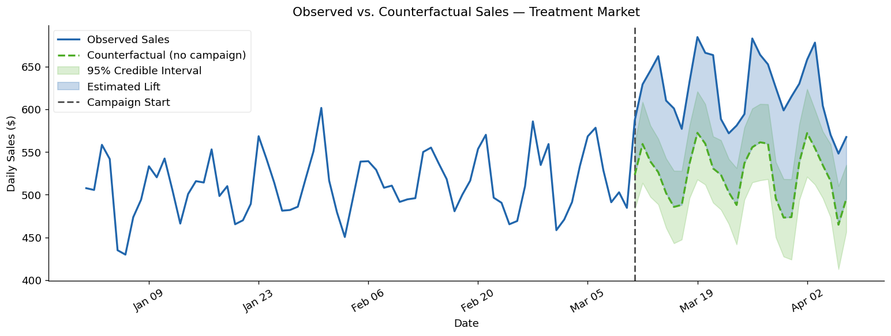
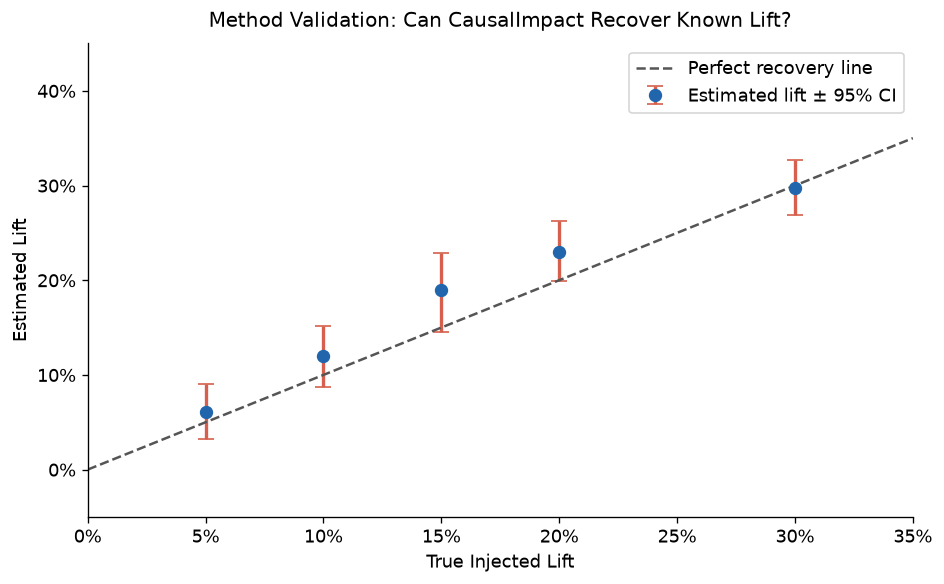
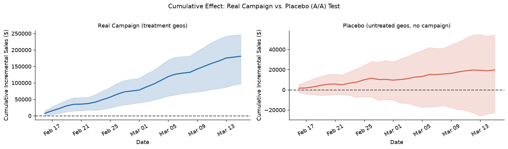

# Geo Incrementality Experiment: Did the Campaign Actually Work?

## Business Question

We ran a marketing campaign in a set of cities (treatment markets) while other comparable cities received no campaign (control markets) - did the campaign drive incremental sales, or would those sales have happened anyway?

## Approach

This project uses a **matched-market test** analyzed with **CausalImpact** (Google's open-source Bayesian structural time series library). The method works in two steps: first, it identifies control markets whose pre-campaign sales moved in lockstep with the treatment markets; second, it uses that relationship to forecast what treatment-market sales *would have been* without the campaign. The gap between observed sales and that counterfactual is the causal estimate of lift - something a simple before/after comparison or correlation analysis cannot provide, because those methods can't separate the campaign effect from background trends.

## Key Findings

- **+18.5% incremental sales lift** in treatment markets during the campaign window (4-week post-period)
- **95% credible interval: +16.4% to +20.7%** - the interval excludes zero, confirming the effect is statistically credible and was not a chance fluctuation
- **Incremental ROAS: 3.40×** - for every $1 of estimated campaign spend, $3.40 in incremental revenue was generated



*The blue line shows actual treatment-market sales; the green dashed line is the model's counterfactual (what sales would have been without the campaign). The shaded blue region is the estimated incremental lift.*

## Method Validation

- The model was validated against simulated data with **known ground-truth lifts ranging from 5% to 30%**; in all five tests the estimated lift closely tracked the true value and the true lift fell inside the 95% credible interval - confirming the method detects real effects and doesn't manufacture lift that isn't there
- A **placebo (A/A) test** on data with no injected lift returned a credible interval that included zero (−3.7% to +0.5%), correctly finding no significant effect



*Estimated lift tracks the true injected lift closely across all five test levels, with tight confidence intervals  - the method recovers known effects accurately.*



*Left: cumulative incremental sales climb steadily when a real lift is present. Right: the placebo test (no lift injected) hovers around zero  - confirming the method doesn't hallucinate effects.*

## Recommendation

**Scale the campaign to additional markets.** The evidence of causal lift is strong (credible interval well above zero), the ROAS is healthy at 3.4×, and the method validation confirms we're not measuring noise. A second wave targeting 10-15 comparable untreated markets is the logical next step, ideally with a pre-registered analysis plan to guard against p-hacking.

## How to Run

```bash
# 1. Clone the repo
git clone https://github.com/dustintdn/incrementality-causal-experiment-learning.git
cd incrementality-causal-experiment-learning

# 2. Create and activate a virtual environment
python -m venv .venv && source .venv/bin/activate

# 3. Install dependencies (Python 3.9+ recommended)
pip install -r requirements.txt

# 4. Launch the notebook
jupyter notebook notebooks/geo_experiment_analysis.ipynb
```

Run all cells top-to-bottom (`Kernel → Restart & Run All`). No external data download is required  - the notebook generates synthetic geo sales data internally.

## Caveats

- **Spillover risk:** If treatment and control markets are geographically adjacent, campaign exposure may "spill" into control markets, compressing the measured lift. Markets were selected to be non-adjacent.
- **Match quality:** CausalImpact's counterfactual is only as good as the pre-period correlation between treatment and control. The notebook plots pre-period fit and reports correlations  - readers should verify the match is tight before trusting the post-period estimate.
- **External shocks:** Any event that affected only treatment markets during the post-period (local promotions, weather, store closures) would bias the estimate. The model cannot distinguish these from campaign effects.
